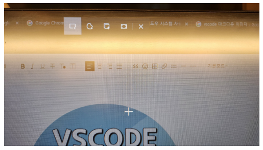

# gkgk

## test

### test h3

#### test h4

```java
class KHE {
public static int exStatic = 88;
public int exInstance = 99;

}
public class StaticTest{
	public static void main(String[] args) {
		System.out.println(KHE.exStatic);
		KHE E1 = new KHE();
		System.out.println(E1.exInstance);
	}
}
```



- Intro
  - back
  - front
  - testman
  ###### this is h6

---

<br>
<hr>

[마크다운](https://inpa.tistory.com/entry/MarkDown-%F0%9F%93%9A-%EB%A7%88%ED%81%AC%EB%8B%A4%EC%9A%B4-%EB%AC%B8%EB%B2%95-%F0%9F%92%AF-%EC%A0%95%EB%A6%AC)

| 헤더1 | 헤더2 | 헤더3 | 헤더4 |
| ----- | ----- | ----- | ----- |
| 셀1   | 셀2   | 셀3   | 셀4   |
| 셀5   | 셀6   | 셀7   | 셀8   |
| 셀9   | 셀10  | 셀11  | 셀12  |

| 헤더1 | 헤더2  | 헤더3 |
| :---- | :----: | ----: |
| Left  | Center | Right |
| 1     |   2    |     3 |
| 4     |   5    |     6 |
| 7     |   8    |     9 |
